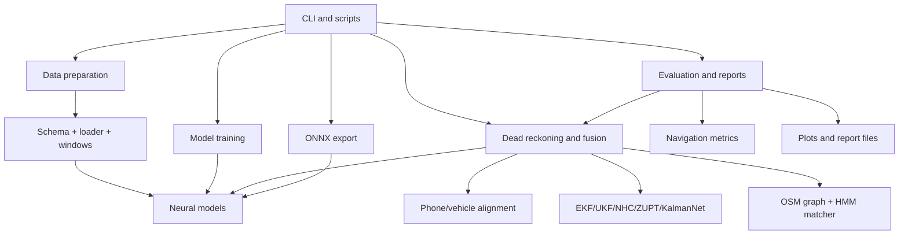
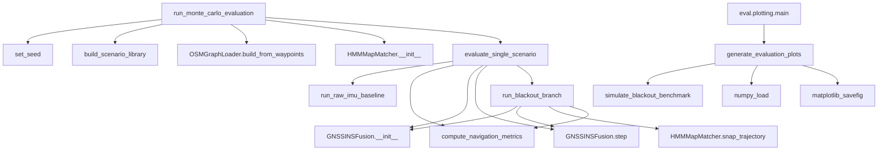

# IDR System Function Catalog and Call Graph

This document is a source-level map of the Python code in `src/idr`, `scripts`, and `tests`.

- **Function boxes** use the same format everywhere: input, output, and a short technical description.
- The call graph records direct intra-project calls visible in the source. Calls into NumPy, PyTorch, pandas, NetworkX, Shapely, Matplotlib, SciPy, and the Python standard library are summarized as external calls rather than expanded.
- Neural-network `forward` methods are invoked indirectly by PyTorch (`model(x)`), so their graph edges are marked `-- runtime -->` where useful.
- The notebooks and generated model/report artifacts are not duplicated here; their reusable Python implementation is represented by the package and scripts.

## System-level hierarchy



## Main runtime call graph

```mermaid
flowchart TD
    main_blackout[eval.blackout.main] --> simulate_blackout_benchmark
    simulate_blackout_benchmark --> set_seed
    simulate_blackout_benchmark --> VelocityEstimatorNet.__init__
    simulate_blackout_benchmark --> OSMGraphLoader.build_from_waypoints
    simulate_blackout_benchmark --> HMMMapMatcher.__init__
    simulate_blackout_benchmark --> run_trajectory_dead_reckoning
    run_trajectory_dead_reckoning --> GNSSINSFusion.__init__
    run_trajectory_dead_reckoning --> GNSSINSFusion.latlon_to_enu
    run_trajectory_dead_reckoning --> VelocityEstimatorNet.forward
    run_trajectory_dead_reckoning --> GNSSINSFusion.step
    GNSSINSFusion.step --> ExtendedKalmanFilter.predict
    GNSSINSFusion.step --> StationaryDetector.update
    GNSSINSFusion.step --> apply_zupt
    GNSSINSFusion.step --> apply_zaru
    GNSSINSFusion.step --> GNSSINSFusion.latlon_to_enu
    GNSSINSFusion.step --> ExtendedKalmanFilter.update_gnss_pos
    GNSSINSFusion.step --> ExtendedKalmanFilter.update_heading
    GNSSINSFusion.step --> ExtendedKalmanFilter.update_gnss_vel
    GNSSINSFusion.step --> ExtendedKalmanFilter.update_velocity
    GNSSINSFusion.step --> ExtendedKalmanFilter.update_velocity_2d
    GNSSINSFusion.step --> apply_nhc_update
    run_trajectory_dead_reckoning --> HMMMapMatcher.snap_trajectory
    simulate_blackout_benchmark --> compute_navigation_metrics
    simulate_blackout_benchmark --> numpy_save

    main_train[models.train_all.main] --> train_pipeline
    train_pipeline --> set_seed
    train_pipeline --> IDRWindowDataset.__init__
    train_pipeline --> train_epoch
    train_pipeline --> eval_epoch
    train_epoch --> IMUDenoiseNet.forward
    train_epoch --> VelocityEstimatorNet.forward
    eval_epoch --> IMUDenoiseNet.forward
    eval_epoch --> VelocityEstimatorNet.forward

    main_prepare[scripts.prepare_data.main] --> preprocess_dataset
    preprocess_dataset --> load_drive_pair
    load_drive_pair --> detect_schema
    load_drive_pair --> standardize_dataframe
    preprocess_dataset --> IOVNBDrive.get_synced_data
    preprocess_dataset --> create_sliding_windows
    create_sliding_windows --> PhoneToVehicleAligner.transform_imu
```



## Monte Carlo and reporting graph



## Function boxes: configuration and calibration

## Complete function inventory diagram

This is the full function-level inventory. Nodes without incoming project edges are reusable leaves, framework callbacks, CLI roots, or currently independent/experimental APIs. The arrows show the important direct project calls; the detailed adjacency list below records the same relationships in text for readers who do not render Mermaid.

```mermaid
flowchart LR
  subgraph CFG[config and calibration]
    cfg_seed[set_seed]
    rot[compute_rotation_matrix]
    align_i[PhoneToVehicleAligner.__init__]
    align_e[estimate_from_stationary_and_motion]
    align_t[transform_imu]
    align_i --> align_e --> rot
    align_t --> rot
  end
  subgraph IO[io]
    sch_imu[SchemaMap.has_required_imu]
    sch_gps[SchemaMap.has_required_gps]
    norm[normalize_col_name]
    detect[detect_schema]
    drive_sync[IOVNBDrive.get_synced_data]
    standardize[standardize_dataframe]
    load[load_drive_pair]
    ds_i[IDRWindowDataset.__init__]
    ds_l[IDRWindowDataset.__len__]
    ds_g[IDRWindowDataset.__getitem__]
    windows[create_sliding_windows]
    prep[preprocess_dataset]
    detect --> norm
    detect --> sch_imu
    detect --> sch_gps
    load --> detect
    load --> standardize
    prep --> load
    prep --> drive_sync
    prep --> windows
  end
  subgraph NN[models and training]
    den_i[IMUDenoiseNet.__init__]
    den_f[IMUDenoiseNet.forward]
    vel_i[VelocityEstimatorNet.__init__]
    vel_f[VelocityEstimatorNet.forward]
    rb_i[ResBlock1D.__init__]
    rb_f[ResBlock1D.forward]
    od_i[InertialOdomNet.__init__]
    od_f[InertialOdomNet.forward]
    nll[gaussian_nll_loss]
    aug[augment_imu_sample]
    res_i[ResidualDriftNet.__init__]
    res_f[ResidualDriftNet.forward]
    kg_i[KalmanNetGainEstimator.__init__]
    kg_f[KalmanNetGainEstimator.forward]
    kf_i[KalmanNetFilter.__init__]
    kf_r[KalmanNetFilter.reset]
    kf_g[KalmanNetFilter.compute_gain]
    te[train_epoch]
    ee[eval_epoch]
    tp[train_pipeline]
    kg_data[generate_kalmannet_training_data]
    tk[train_kalmannet]
    ao_i[AugmentedOdomDataset.__init__]
    ao_l[AugmentedOdomDataset.__len__]
    ao_g[AugmentedOdomDataset.__getitem__]
    ext[extract_drive_windows]
    all_drives[prepare_all_drives]
    ti[train_inertial_odom]
    export[export_models_to_onnx]
    te --> den_f
    te --> vel_f
    ee --> den_f
    ee --> vel_f
    tp --> cfg_seed
    tp --> ds_i
    tp --> te
    tp --> ee
    tk --> kg_data
    tk --> kg_f
    ti --> all_drives
    ti --> ao_i
    ti --> od_f
    ti --> nll
    export --> den_i
    export --> vel_i
    export --> od_i
  end
  subgraph FILTER[Fusion and filters]
    ek_i[ExtendedKalmanFilter.__init__]
    ek_p[ExtendedKalmanFilter.predict]
    ek_pos[ExtendedKalmanFilter.update_gnss_pos]
    ek_h[ExtendedKalmanFilter.update_heading]
    ek_v[ExtendedKalmanFilter.update_velocity]
    ek_gv[ExtendedKalmanFilter.update_gnss_vel]
    ek_2d[ExtendedKalmanFilter.update_velocity_2d]
    fus_i[GNSSINSFusion.__init__]
    fus_ll[GNSSINSFusion.latlon_to_enu]
    fus_el[GNSSINSFusion.enu_to_latlon]
    fus_s[GNSSINSFusion.step]
    nhc[apply_nhc_update]
    uk_i[UnscentedKalmanFilter.__init__]
    uk_sig[UnscentedKalmanFilter.generate_sigma_points]
    uk_p[UnscentedKalmanFilter.predict]
    uk_u[UnscentedKalmanFilter.update_measurement]
    stat_i[StationaryDetector.__init__]
    stat_u[StationaryDetector.update]
    zupt[apply_zupt]
    zaru[apply_zaru]
    vp[VehicleProfile.compute_nhc_sigmas]
    car[CarProfile.__init__]
    two[TwoWheelerProfile.__init__]
    roll[TwoWheelerProfile.estimate_roll_angle]
    two_s[TwoWheelerProfile.compute_nhc_sigmas]
    fus_s --> ek_p
    fus_s --> stat_u
    fus_s --> zupt
    fus_s --> zaru
    fus_s --> fus_ll
    fus_s --> ek_pos
    fus_s --> ek_h
    fus_s --> ek_gv
    fus_s --> ek_v
    fus_s --> ek_2d
    fus_s --> nhc
    two_s --> roll
  end
  subgraph MAP[map matching]
    osm_i[OSMGraphLoader.__init__]
    osm_l[OSMGraphLoader.load_or_fetch]
    osm_syn[OSMGraphLoader._build_synthetic_graph]
    osm_wp[OSMGraphLoader.build_from_waypoints]
    hmm_i[HMMMapMatcher.__init__]
    hmm_e[HMMMapMatcher._extract_edges]
    hmm_s[HMMMapMatcher.snap_trajectory]
    hmm_i --> hmm_e
    osm_l --> osm_syn
  end
  subgraph EVAL[Evaluation and reporting]
    metrics[compute_navigation_metrics]
    raw[run_raw_imu_baseline]
    dr[run_trajectory_dead_reckoning]
    bench[simulate_blackout_benchmark]
    bike_s[synthesize_twowheeler_trajectory]
    bike_e[evaluate_twowheeler_performance]
    scenario[build_scenario_library]
    single[evaluate_single_scenario]
    branch[run_blackout_branch]
    mc[run_monte_carlo_evaluation]
    smooth_i[ReacquisitionSmoother.__init__]
    smooth_t[ReacquisitionSmoother.trigger_reacquisition]
    smooth_a[ReacquisitionSmoother.apply_smoothing]
    profile[profile_pipeline]
    plots[generate_evaluation_plots]
    lazy[eval.__getattr__]
    bench --> cfg_seed
    bench --> dr
    bench --> metrics
    dr --> fus_s
    dr --> vel_f
    dr --> hmm_s
    single --> raw
    single --> branch
    single --> metrics
    branch --> fus_s
    branch --> hmm_s
    branch --> metrics
    mc --> cfg_seed
    mc --> scenario
    mc --> single
    plots --> bench
  end
  subgraph CLI[script entry points]
    dl_gen[generate_mock_iovnbd_dataset]
    dl[download_iovnbd]
    valid[validate_dataset]
    dl_main[scripts.download_data.main]
    prep_main[scripts.prepare_data.main]
    exp_all[export_all_models]
    exp_main[export.convert.main]
    black_main[eval.blackout.main]
    plot_main[eval.plotting.main]
    train_main[models.train_all.main]
    odom_main[models.train_odom.main]
    dl --> dl_gen
    dl_main --> dl
    dl_main --> valid
    prep_main --> prep
    exp_all --> exp_main
    black_main --> bench
    plot_main --> plots
    train_main --> tp
    odom_main --> ti
  end
  subgraph TESTS[tests]
    test_den[test_imu_denoise_net_forward]
    test_vel[test_velocity_net_forward]
    test_ekf[test_ekf_prediction_and_nhc]
    test_metrics[test_navigation_metrics]
    test_den --> den_f
    test_vel --> vel_f
    test_ekf --> ek_p
    test_ekf --> nhc
    test_metrics --> metrics
  end
```



> **BOX: `config.set_seed`**  
> **Input:** `seed: int`  **Output:** `None`  
> **Does:** Seeds Python, NumPy, and Torch random generators for repeatable experiments.

> **BOX: `PhoneToVehicleAligner.__init__`**  
> **Input:** `self`  **Output:** initialized aligner  
> **Does:** Creates the phone-to-vehicle rotation state used by IMU preprocessing.

> **BOX: `compute_rotation_matrix`**  
> **Input:** `pitch`, `roll`, `yaw: float`  **Output:** `3x3 np.ndarray`  
> **Does:** Builds the 3D Euler-angle rotation matrix used for frame alignment.

> **BOX: `PhoneToVehicleAligner.estimate_from_stationary_and_motion`**  
> **Input:** stationary and motion IMU arrays  **Output:** estimated alignment parameters/state  
> **Does:** Infers phone mounting orientation from gravity and vehicle-motion directions.

> **BOX: `PhoneToVehicleAligner.transform_imu`**  
> **Input:** `acc`, `gyro: np.ndarray`  **Output:** transformed acceleration and gyro arrays  
> **Does:** Applies the estimated phone-to-vehicle rotation to both IMU channels.

## Function boxes: schema, loading, and preprocessing

> **BOX: `SchemaMap.has_required_imu`**  
> **Input:** `self`  **Output:** `bool`  
> **Does:** Checks that all six canonical accelerometer and gyroscope fields are mapped.

> **BOX: `SchemaMap.has_required_gps`**  
> **Input:** `self`  **Output:** `bool`  
> **Does:** Checks whether latitude and longitude fields are available.

> **BOX: `normalize_col_name`**  
> **Input:** raw column name `str`  **Output:** normalized `str`  
> **Does:** Converts whitespace, hyphens, and dots into a stable lowercase alias form.

> **BOX: `detect_schema`**  
> **Input:** CSV path or `DataFrame`, optional file-type hint  **Output:** `SchemaMap`  
> **Does:** Resolves dataset-specific column aliases to canonical IMU, GPS, and vehicle fields and validates required IMU data.  
> **Calls:** `normalize_col_name`, `SchemaMap.has_required_imu`, `SchemaMap.has_required_gps`.

> **BOX: `IOVNBDrive.get_synced_data`**  
> **Input:** `self`  **Output:** synchronized IMU, GPS, vehicle speed, and timestamps  
> **Does:** Extracts canonical arrays from standardized phone and vehicle tables and aligns their time bases.

> **BOX: `standardize_dataframe`**  
> **Input:** `DataFrame`, `SchemaMap`  **Output:** standardized `DataFrame`  
> **Does:** Renames mapped columns, normalizes timestamps to seconds from zero, synthesizes timestamps when absent, and interpolates missing values.

> **BOX: `load_drive_pair`**  
> **Input:** `drive_dir: Path`, `drive_id: str`  **Output:** `IOVNBDrive`  
> **Does:** Finds smartphone and optional vehicle CSVs, detects schemas, standardizes both files, and constructs the drive object.  
> **Calls:** `detect_schema`, `standardize_dataframe`.

> **BOX: `IDRWindowDataset.__init__`**  
> **Input:** window and target arrays  **Output:** dataset instance  
> **Does:** Stores training windows, velocity targets, and IMU residual targets.

> **BOX: `IDRWindowDataset.__len__`**  
> **Input:** `self`  **Output:** sample count `int`  
> **Does:** Returns the number of training windows.

> **BOX: `IDRWindowDataset.__getitem__`**  
> **Input:** integer index  **Output:** Torch tensors for window, velocity target, and IMU target  
> **Does:** Converts one stored sample into the batch format expected by PyTorch.

> **BOX: `create_sliding_windows`**  
> **Input:** IMU array, speed array, window size, stride, optional clean IMU reference  **Output:** window tensor, velocity targets, IMU targets  
> **Does:** Creates overlapping temporal samples and targets for velocity estimation and denoising.

> **BOX: `preprocess_dataset`**  
> **Input:** raw data directory, output directory, optional `DatasetConfig`  **Output:** mapping of split names to NPZ paths  
> **Does:** Loads configured drives, synchronizes signals, creates windows, concatenates splits, and writes compressed train/validation/test data.  
> **Calls:** `load_drive_pair`, `IOVNBDrive.get_synced_data`, `create_sliding_windows`.

## Function boxes: neural models

> **BOX: `IMUDenoiseNet.__init__`**  
> **Input:** channel, hidden, and output dimensions  **Output:** initialized CNN model  
> **Does:** Builds dilated residual 1D convolutions, global pooling, and a residual regression head.

> **BOX: `IMUDenoiseNet.forward`**  
> **Input:** `x: Tensor[B, 6, L]`  **Output:** residual correction `Tensor[B, 6]`  
> **Does:** Extracts temporal IMU features and predicts bias/noise values to subtract.

> **BOX: `VelocityEstimatorNet.__init__`**  
> **Input:** channel count, hidden size, GRU layer count  **Output:** initialized speed model  
> **Does:** Builds dilated temporal convolutions, a GRU, a positive speed regressor, and a motion gate.

> **BOX: `VelocityEstimatorNet.forward`**  
> **Input:** `x: Tensor[B, 6, L]`  **Output:** non-negative speed `Tensor[B, 1]`  
> **Does:** Encodes an IMU window, integrates temporal features, regresses speed, and gates stationary motion.

> **BOX: `ResBlock1D.__init__`**  
> **Input:** input/output channels and dilation  **Output:** residual block  
> **Does:** Configures a dilated convolutional residual feature block.

> **BOX: `ResBlock1D.forward`**  
> **Input:** feature tensor  **Output:** transformed feature tensor  
> **Does:** Applies the residual convolution path and combines it with the shortcut.

> **BOX: `InertialOdomNet.__init__`**  
> **Input:** channels, window size, hidden size  **Output:** initialized odometry model  
> **Does:** Builds the inertial odometry feature extractor and probabilistic output head.

> **BOX: `InertialOdomNet.forward`**  
> **Input:** IMU window tensor  **Output:** odometry prediction tensor  
> **Does:** Encodes a window and predicts motion/displacement quantities for inertial odometry.

> **BOX: `gaussian_nll_loss`**  
> **Input:** predicted mean/uncertainty and target tensors  **Output:** scalar loss tensor  
> **Does:** Computes Gaussian negative log likelihood for probabilistic odometry regression.

> **BOX: `augment_imu_sample`**  
> **Input:** IMU sample and augmentation parameters  **Output:** augmented IMU sample  
> **Does:** Adds realistic perturbations to increase inertial-odometry training variation.

> **BOX: `ResidualDriftNet.__init__`**  
> **Input:** feature and hidden dimensions  **Output:** initialized residual model  
> **Does:** Builds the network that estimates residual trajectory drift corrections.

> **BOX: `ResidualDriftNet.forward`**  
> **Input:** feature tensor  **Output:** residual correction tensor  
> **Does:** Predicts drift residuals from fused motion features.

> **BOX: `KalmanNetGainEstimator.__init__`**  
> **Input:** state dimension, measurement dimension, hidden size  **Output:** initialized GRU gain estimator  
> **Does:** Builds feature projection, recurrent state, and Kalman-gain output head.

> **BOX: `KalmanNetGainEstimator.forward`**  
> **Input:** innovation tensor, predicted-state tensor, optional hidden state  **Output:** gain matrix and next hidden state  
> **Does:** Recurrently predicts a Kalman gain from innovation and state features.

> **BOX: `KalmanNetFilter.__init__`**  
> **Input:** model/configuration parameters  **Output:** filter wrapper  
> **Does:** Creates the learned gain estimator and state needed for drop-in neural filtering.

> **BOX: `KalmanNetFilter.reset`**  
> **Input:** `self`  **Output:** `None`  
> **Does:** Clears recurrent hidden state and filter state for a new sequence.

> **BOX: `KalmanNetFilter.compute_gain`**  
> **Input:** innovation and predicted state  **Output:** Kalman gain tensor  
> **Does:** Requests a learned gain and applies the wrapper's safety/fallback policy.

## Function boxes: model training and export

> **BOX: `train_epoch`**  
> **Input:** model, loader, optimizer, loss criterion, target selector  **Output:** mean loss `float`  
> **Does:** Runs one gradient-training epoch over velocity or denoising targets.

> **BOX: `eval_epoch`**  
> **Input:** model, loader, criterion, target selector  **Output:** mean validation loss `float`  
> **Does:** Evaluates a model without gradients over one dataset split.

> **BOX: `train_pipeline`**  
> **Input:** data and output directories  **Output:** saved model checkpoints  
> **Does:** Loads or synthesizes data, trains velocity and IMU-denoising models, and saves the best checkpoints.  
> **Calls:** `set_seed`, `IDRWindowDataset`, `train_epoch`, `eval_epoch`.

> **BOX: `generate_kalmannet_training_data`**  
> **Input:** number of samples  **Output:** Torch training tensors  
> **Does:** Generates synthetic state, measurement, and target-gain data for KalmanNet training.

> **BOX: `train_kalmannet`**  
> **Input:** output directory, epochs, batch size, learning rate  **Output:** saved KalmanNet checkpoint  
> **Does:** Builds synthetic training data, optimizes the recurrent gain estimator, and writes model weights.

> **BOX: `AugmentedOdomDataset.__init__`**  
> **Input:** windows, targets, augmentation flag/factor  **Output:** dataset instance  
> **Does:** Stores inertial-odometry samples and configures optional replication/augmentation.

> **BOX: `AugmentedOdomDataset.__len__`**  
> **Input:** `self`  **Output:** sample count `int`  
> **Does:** Reports the effective augmented dataset length.

> **BOX: `AugmentedOdomDataset.__getitem__`**  
> **Input:** sample index  **Output:** IMU-window and odometry-target tensors  
> **Does:** Retrieves a sample and applies configured augmentation when enabled.

> **BOX: `extract_drive_windows`**  
> **Input:** drive data and window parameters  **Output:** windows and odometry targets  
> **Does:** Extracts fixed-length inertial windows from one drive for odometry training.

> **BOX: `prepare_all_drives`**  
> **Input:** raw directory, window size  **Output:** train/validation/test arrays  
> **Does:** Traverses drives, extracts windows, and assembles dataset splits for odometry.

> **BOX: `train_inertial_odom`**  
> **Input:** raw data and model output/training parameters  **Output:** trained odometry checkpoint  
> **Does:** Prepares augmented windows, trains `InertialOdomNet`, evaluates it, and saves weights.

> **BOX: `export_models_to_onnx`**  
> **Input:** model directory and output directory  **Output:** ONNX files  
> **Does:** Loads supported PyTorch checkpoints, creates example inputs, and exports deployable ONNX graphs.

> **BOX: `scripts.export_onnx.export_all_models`**  
> **Input:** model directory  **Output:** exported model artifacts  
> **Does:** Script-level adapter that invokes the package export pipeline for all available models.

> **BOX: `eval.blackout.main`**  
> **Input:** `--data-dir`, `--model-dir`, `--report-dir` CLI arguments  **Output:** process exit  
> **Does:** Parses benchmark paths and calls `simulate_blackout_benchmark`.

> **BOX: `eval.plotting.main`**  
> **Input:** report and output directory CLI arguments  **Output:** process exit  
> **Does:** Parses plotting paths and calls `generate_evaluation_plots`.

> **BOX: `export.convert.main`**  
> **Input:** model and output directory CLI arguments  **Output:** process exit  
> **Does:** Parses export paths and calls `export_models_to_onnx`.

> **BOX: `models.train_all.main`**  
> **Input:** data and output directory CLI arguments  **Output:** process exit  
> **Does:** Parses training paths and calls `train_pipeline`.

> **BOX: `models.train_odom.main`**  
> **Input:** raw data, output directory, and odometry hyperparameter CLI arguments  **Output:** process exit  
> **Does:** Parses odometry-training options and calls `train_inertial_odom`.

> **BOX: `scripts.download_data.main`**  
> **Input:** dataset output and validation CLI arguments  **Output:** process exit  
> **Does:** Parses dataset options and dispatches download/mock generation and validation.

> **BOX: `scripts.prepare_data.main`**  
> **Input:** raw and processed directory CLI arguments  **Output:** process exit  
> **Does:** Parses preprocessing paths and calls `preprocess_dataset`.

## Function boxes: EKF, fusion, and motion constraints

> **BOX: `ExtendedKalmanFilter.__init__`**  
> **Input:** `dt`  **Output:** initialized 9-state EKF  
> **Does:** Initializes ENU state, covariance, and tuned process noise matrices.

> **BOX: `ExtendedKalmanFilter.predict`**  
> **Input:** forward acceleration and yaw rate  **Output:** mutated state/covariance  
> **Does:** Bias-corrects IMU inputs, integrates planar vehicle motion, computes the Jacobian, and propagates covariance.

> **BOX: `ExtendedKalmanFilter.update_gnss_pos`**  
> **Input:** ENU position and optional covariance  **Output:** mutated state/covariance  
> **Does:** Applies a position measurement Kalman update.

> **BOX: `ExtendedKalmanFilter.update_heading`**  
> **Input:** yaw measurement and noise  **Output:** mutated state/covariance  
> **Does:** Applies a wrapped angular heading update.

> **BOX: `ExtendedKalmanFilter.update_velocity`**  
> **Input:** forward speed and noise  **Output:** mutated state/covariance  
> **Does:** Updates velocity using a scalar forward-speed measurement.

> **BOX: `ExtendedKalmanFilter.update_gnss_vel`**  
> **Input:** ENU velocity and optional covariance  **Output:** mutated state/covariance  
> **Does:** Applies a 3D GNSS velocity measurement update.

> **BOX: `ExtendedKalmanFilter.update_velocity_2d`**  
> **Input:** body-frame forward/lateral velocity and optional covariance  **Output:** mutated state/covariance  
> **Does:** Converts body-frame velocity to the current ENU heading and updates the filter.

> **BOX: `GNSSINSFusion.__init__`**  
> **Input:** reference latitude/longitude and timestep  **Output:** fusion engine  
> **Does:** Creates the ENU projection, EKF, stationary detector, blackout state, and trajectory state.

> **BOX: `GNSSINSFusion.latlon_to_enu`**  
> **Input:** latitude and longitude  **Output:** east/north/up tuple  
> **Does:** Projects WGS84 coordinates into the local ENU frame, using pyproj or a flat-Earth fallback.

> **BOX: `GNSSINSFusion.enu_to_latlon`**  
> **Input:** east and north meters  **Output:** latitude/longitude tuple  
> **Does:** Converts local ENU coordinates back to WGS84, using the matching projection fallback.

> **BOX: `GNSSINSFusion.step`**  
> **Input:** IMU acceleration/yaw, optional GNSS, optional AI velocity, blackout flag, NHC flag, optional 3D IMU  **Output:** current EKF state array  
> **Does:** Executes one 10 Hz predict/update cycle, including GNSS reacquisition, AI velocity, NHC, ZUPT, and ZARU branches.  
> **Calls:** EKF update methods, `StationaryDetector.update`, `apply_zupt`, `apply_zaru`, `apply_nhc_update`, and `latlon_to_enu`.

> **BOX: `apply_nhc_update`**  
> **Input:** EKF and lateral/vertical noise values  **Output:** mutated EKF state/covariance  
> **Does:** Applies zero lateral and vertical body-velocity pseudo-measurements with heading observability.

> **BOX: `UnscentedKalmanFilter.__init__`**  
> **Input:** timestep and UKF alpha/beta/kappa  **Output:** initialized UKF  
> **Does:** Initializes state, covariance, sigma-point weights, and process model settings.

> **BOX: `UnscentedKalmanFilter.generate_sigma_points`**  
> **Input:** `self`  **Output:** sigma-point matrix  
> **Does:** Computes scaled sigma points from the current state covariance.

> **BOX: `UnscentedKalmanFilter.predict`**  
> **Input:** forward acceleration and yaw rate  **Output:** mutated UKF state/covariance  
> **Does:** Propagates sigma points through the inertial motion model and recombines them.

> **BOX: `UnscentedKalmanFilter.update_measurement`**  
> **Input:** measurement, measurement function, covariance  **Output:** mutated UKF state/covariance  
> **Does:** Projects sigma points into measurement space and performs the UKF correction.

> **BOX: `StationaryDetector.__init__`**  
> **Input:** window and acceleration/gyro thresholds  **Output:** detector instance  
> **Does:** Configures rolling stationary-state detection.

> **BOX: `StationaryDetector.update`**  
> **Input:** 3D acceleration and gyro arrays  **Output:** stationary `bool`  
> **Does:** Updates rolling signal statistics and decides whether the platform is stationary.

> **BOX: `apply_zupt`**  
> **Input:** EKF and velocity noise  **Output:** mutated EKF state/covariance  
> **Does:** Applies a zero-velocity pseudo-measurement during detected stationarity.

> **BOX: `apply_zaru`**  
> **Input:** EKF and raw yaw-rate measurement/noise  **Output:** mutated EKF state/covariance  
> **Does:** Applies a zero-angular-rate update for gyro-bias correction.

> **BOX: `VehicleProfile.compute_nhc_sigmas`**  
> **Input:** yaw rate and forward speed  **Output:** lateral/vertical sigma tuple  
> **Does:** Base vehicle-profile contract for selecting NHC uncertainty.

> **BOX: `CarProfile.__init__`**  
> **Input:** lateral/vertical sigma defaults  **Output:** car profile  
> **Does:** Stores tight NHC constraints appropriate for four-wheel vehicles.

> **BOX: `TwoWheelerProfile.__init__`**  
> **Input:** lateral/vertical sigma defaults  **Output:** two-wheeler profile  
> **Does:** Stores relaxed constraints appropriate for lean and lateral dynamics.

> **BOX: `TwoWheelerProfile.estimate_roll_angle`**  
> **Input:** forward speed and yaw rate  **Output:** roll angle `float`  
> **Does:** Estimates bicycle/motorcycle roll from lateral acceleration geometry.

> **BOX: `TwoWheelerProfile.compute_nhc_sigmas`**  
> **Input:** yaw rate and forward speed  **Output:** adapted sigma tuple  
> **Does:** Relaxes NHC uncertainty as two-wheeler dynamics and roll increase.

## Function boxes: map matching

> **BOX: `OSMGraphLoader.__init__`**  
> **Input:** optional cache directory  **Output:** loader instance  
> **Does:** Creates the cache directory and initializes the graph handle.

> **BOX: `OSMGraphLoader.load_or_fetch`**  
> **Input:** bounding box and area name  **Output:** `MultiDiGraph`  
> **Does:** Loads cached GraphML, fetches OSM road data online, or falls back to a synthetic graph.

> **BOX: `OSMGraphLoader._build_synthetic_graph`**  
> **Input:** bounding box  **Output:** synthetic `MultiDiGraph`  
> **Does:** Builds one representative road corridor for offline operation.

> **BOX: `OSMGraphLoader.build_from_waypoints`**  
> **Input:** ENU waypoint array  **Output:** road-centerline `MultiDiGraph`  
> **Does:** Converts trajectory waypoints into connected line-segment graph edges.

> **BOX: `HMMMapMatcher.__init__`**  
> **Input:** graph and emission/transition scales  **Output:** matcher instance  
> **Does:** Stores matching parameters and extracts candidate road geometries.  
> **Calls:** `_extract_edges`.

> **BOX: `HMMMapMatcher._extract_edges`**  
> **Input:** `self`  **Output:** `None`, populates edge list  
> **Does:** Reads edge geometry or reconstructs straight segments from graph endpoints.

> **BOX: `HMMMapMatcher.snap_trajectory`**  
> **Input:** list of coordinate pairs  **Output:** snapped coordinate list  
> **Does:** Projects each point to the nearest road geometry when it lies inside the configured corridor.

## Function boxes: evaluation and reporting

> **BOX: `NavigationMetrics.__init__`**  
> **Input:** metric fields  **Output:** metrics value object  
> **Does:** Stores total distance, drift, RMSE, CEP, and DRMS results.

> **BOX: `compute_navigation_metrics`**  
> **Input:** predicted and ground-truth ENU trajectories  **Output:** `NavigationMetrics`  
> **Does:** Computes distance, final drift, drift percentage, position RMSE, CEP50, and DRMS95.

> **BOX: `run_raw_imu_baseline`**  
> **Input:** IMU, ground truth, blackout indices, timestep  **Output:** predicted ENU trajectory  
> **Does:** Produces an open-loop double-integration baseline during a GNSS outage.

> **BOX: `run_trajectory_dead_reckoning`**  
> **Input:** IMU, GPS, blackout mask, optional velocity model/NHC/map matcher  **Output:** predicted ENU, ground-truth ENU, AI speeds  
> **Does:** Runs the complete single-trajectory dead-reckoning pipeline and optional map snap.

> **BOX: `simulate_blackout_benchmark`**  
> **Input:** data, model, and report directories  **Output:** results dictionary plus JSON/NPZ artifacts  
> **Does:** Synthesizes a curved drive, simulates sensor noise and a GNSS blackout, evaluates configurations, and saves metrics.

> **BOX: `synthesize_twowheeler_trajectory`**  
> **Input:** sample count and timestep  **Output:** two-wheeler truth, IMU, and GNSS arrays  
> **Does:** Generates a deterministic two-wheeler motion scenario with turning and sensor effects.

> **BOX: `evaluate_twowheeler_performance`**  
> **Input:** none  **Output:** configuration-to-metrics dictionary  
> **Does:** Runs the two-wheeler scenario through relevant filtering and reports performance.

> **BOX: `OutageScenario.__init__`**  
> **Input:** scenario arrays, blackout interval, reference coordinates  **Output:** scenario value object  
> **Does:** Stores one generated Monte Carlo outage scenario.

> **BOX: `build_scenario_library`**  
> **Input:** raw directory and target scenario count  **Output:** list of `OutageScenario` objects  
> **Does:** Builds a diverse library of outage scenarios from available drives or synthetic fallback data.

> **BOX: `evaluate_single_scenario`**  
> **Input:** scenario, optional matcher, optional KalmanNet filter  **Output:** configuration-to-metrics dictionary  
> **Does:** Evaluates raw, EKF, NHC, map-snap, and KalmanNet branches for one scenario.  
> **Calls:** `run_raw_imu_baseline`, `compute_navigation_metrics`, `GNSSINSFusion.step`, `run_blackout_branch`.

> **BOX: `run_blackout_branch`**  
> **Input:** NHC/KalmanNet/map-snap flags  **Output:** one branch's metrics dictionary  
> **Does:** Replays the outage from a cached pre-blackout state, optionally snaps the predicted points, and computes metrics.  
> **Scope:** Nested helper inside `evaluate_single_scenario`.

> **BOX: `run_monte_carlo_evaluation`**  
> **Input:** raw directory, report directory, model directory, scenario count  **Output:** aggregate evaluation dictionary and report artifacts  
> **Does:** Builds scenarios, configures map matching and KalmanNet, evaluates all scenarios, and writes multi-scenario results.

> **BOX: `ReacquisitionSmoother.__init__`**  
> **Input:** blend duration and timestep  **Output:** smoother instance  
> **Does:** Initializes state for gradual GNSS reacquisition blending.

> **BOX: `ReacquisitionSmoother.trigger_reacquisition`**  
> **Input:** current DR ENU and GNSS ENU coordinates  **Output:** blend offset/distance scalar  
> **Does:** Captures the discontinuity to be smoothed when GNSS returns.

> **BOX: `ReacquisitionSmoother.apply_smoothing`**  
> **Input:** current DR ENU and raw GNSS ENU  **Output:** smoothed ENU coordinate  
> **Does:** Applies a time-ramped correction instead of an instantaneous GNSS jump.

> **BOX: `profile_pipeline`**  
> **Input:** iteration count  **Output:** timing dictionary  
> **Does:** Benchmarks repeated fusion/filter operations and returns elapsed-time statistics.

> **BOX: `generate_evaluation_plots`**  
> **Input:** report and output directories  **Output:** PNG figures and report files  
> **Does:** Loads evaluation arrays/results, computes plot series, saves publication-style figures, and writes the results summary.  
> **Calls:** `simulate_blackout_benchmark` when trajectory artifacts are absent.

> **BOX: `eval.__getattr__`**  
> **Input:** requested attribute name  **Output:** lazy benchmark function or `AttributeError`  
> **Does:** Lazily imports the Torch-backed blackout benchmark to keep the evaluation package lightweight.

## Function boxes: scripts and tests

> **BOX: `scripts.download_data.generate_mock_iovnbd_dataset`**  
> **Input:** target directory  **Output:** mock CSV dataset files  
> **Does:** Generates representative smartphone/vehicle data for offline development.

> **BOX: `scripts.download_data.download_iovnbd`**  
> **Input:** output directory  **Output:** downloaded or generated raw dataset  
> **Does:** Retrieves the external dataset when available and falls back to mock data.

> **BOX: `scripts.download_data.validate_dataset`**  
> **Input:** raw data directory  **Output:** validation status/log output  
> **Does:** Checks that expected drive files and required columns are present.

> **BOX: `scripts.download_data.main`**  
> **Input:** CLI arguments  **Output:** process exit  
> **Does:** Dispatches dataset download and validation operations.

> **BOX: `scripts.prepare_data.main`**  
> **Input:** CLI arguments  **Output:** processed NPZ files  
> **Does:** Parses raw/output paths and calls `preprocess_dataset`.

> **BOX: `tests.test_imu_denoise_net_forward`**  
> **Input:** none  **Output:** assertion result  
> **Does:** Verifies denoising model output shape.

> **BOX: `tests.test_velocity_net_forward`**  
> **Input:** none  **Output:** assertion result  
> **Does:** Verifies speed output shape and non-negativity.

> **BOX: `tests.test_ekf_prediction_and_nhc`**  
> **Input:** none  **Output:** assertion result  
> **Does:** Verifies EKF motion prediction and finite NHC-updated state.

> **BOX: `tests.test_navigation_metrics`**  
> **Input:** none  **Output:** assertion result  
> **Does:** Verifies distance, final drift, drift percentage, and the 10% acceptance threshold.

## Direct call index by module

The following index is the compact adjacency list behind the diagrams. A listed edge means the caller directly invokes the callee in source or through a local object method. Framework callbacks and ordinary library calls are omitted.

```text
scripts.download_data.main
  -> download_iovnbd -> generate_mock_iovnbd_dataset, validate_dataset
scripts.prepare_data.main
  -> preprocess_dataset
scripts.export_onnx.export_all_models
  -> export_models_to_onnx

io.schema.detect_schema
  -> normalize_col_name, SchemaMap.has_required_imu, SchemaMap.has_required_gps
io.loader.load_drive_pair
  -> detect_schema, standardize_dataframe, IOVNBDrive
io.preprocess.preprocess_dataset
  -> load_drive_pair, IOVNBDrive.get_synced_data, create_sliding_windows

models.train_all.train_pipeline
  -> set_seed, IDRWindowDataset, train_epoch, eval_epoch
models.train_all.train_epoch / eval_epoch
  -> model.forward (runtime-dispatched)
models.train_odom.prepare_all_drives
  -> extract_drive_windows, load_drive_pair
models.train_odom.train_inertial_odom
  -> prepare_all_drives, AugmentedOdomDataset, InertialOdomNet.forward,
     gaussian_nll_loss
models.train_kalmannet.train_kalmannet
  -> generate_kalmannet_training_data, KalmanNetGainEstimator.forward
export.convert.export_models_to_onnx
  -> IMUDenoiseNet, VelocityEstimatorNet, InertialOdomNet, torch.onnx.export

GNSSINSFusion.step
  -> ExtendedKalmanFilter.predict, StationaryDetector.update,
     apply_zupt, apply_zaru, latlon_to_enu, ExtendedKalmanFilter.update_gnss_pos,
     ExtendedKalmanFilter.update_heading, ExtendedKalmanFilter.update_gnss_vel,
     ExtendedKalmanFilter.update_velocity, ExtendedKalmanFilter.update_velocity_2d,
     apply_nhc_update

blackout.simulate_blackout_benchmark
  -> set_seed, OSMGraphLoader.build_from_waypoints, HMMMapMatcher,
     run_trajectory_dead_reckoning, compute_navigation_metrics
blackout.run_trajectory_dead_reckoning
  -> GNSSINSFusion, GNSSINSFusion.latlon_to_enu, VelocityEstimatorNet.forward,
     GNSSINSFusion.step, HMMMapMatcher.snap_trajectory

monte_carlo.run_monte_carlo_evaluation
  -> set_seed, build_scenario_library, OSMGraphLoader.build_from_waypoints,
     HMMMapMatcher, evaluate_single_scenario
monte_carlo.evaluate_single_scenario
  -> run_raw_imu_baseline, compute_navigation_metrics, GNSSINSFusion,
     GNSSINSFusion.step, run_blackout_branch
monte_carlo.run_blackout_branch
  -> GNSSINSFusion, GNSSINSFusion.step, HMMMapMatcher.snap_trajectory,
     compute_navigation_metrics
plotting.generate_evaluation_plots
  -> simulate_blackout_benchmark (only when artifacts are missing)
```

## Coverage and limitations

This catalog covers function and method definitions found by source inspection in the repository's Python files. It intentionally does not treat imported library methods, Torch's internal module calls, dataclass-generated methods, notebook cells, or shell/Make targets as project-defined functions. Python dynamic imports, CLI dispatch, and `nn.Module.__call__` are represented with notes where a static call edge would otherwise be misleading.
